# Attention分享

> 周知瑞@研发中心, Jun 20, 2018
>
> zhouzr@chinawyny.com

## （一）深度学习中的直觉

+ 3 X 1 and 1 X 3 代替 3 X 3

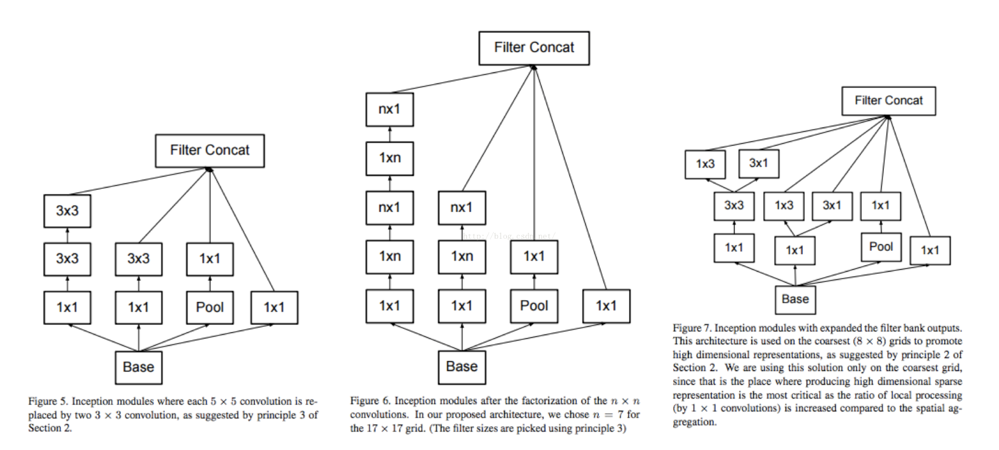

+ LSTM中的门设计

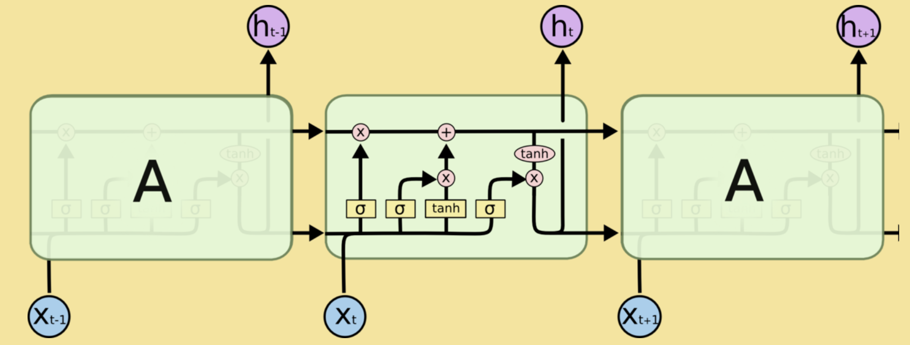

+ 生成对抗网络

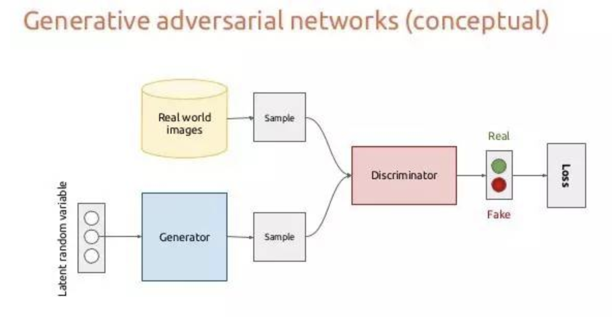

Attention机制的本质来自于人类视觉注意力机制。人们视觉在感知东西的时候一般不会是一个场景从到头看到尾每次全部都看，而往往是根据需求观察注意特定的一部分。而且当人们发现一个场景经常在某部分出现自己想观察的东西时，人们会进行学习在将来再出现类似场景时把注意力放到该部分上。：

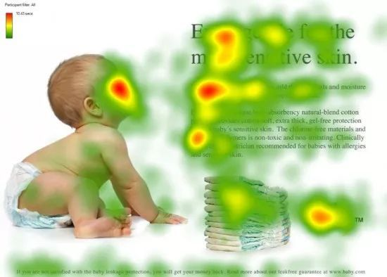

将更多的注意力聚焦到有用的部分，Attention的本质就是加权。但值得注意的是，同一张图片，人在做不同任务的时候，注意力的权重分布应该是不同的。

基于以上的直觉，Attention可以用于：

1. 学习权重分布：

   + 这个加权可以是保留所有分量均做加权（即soft attention）；也可以是在分布中以某种采样策略选取部分分量（即hard attention），此时常用RL来做；
   + 这个加权可以作用在原图上，也可以作用在特征图上；
   + 这个加权可以在时间维度、空间维度、mapping维度以及feature维度。

   以seq2seq举例，传统的模型decoder输入的上下文c是一成不变的，但这显然不够合理，如果这是一个翻译模型，原文为“我喜欢食物”，当我翻译到"i like"时，我翻译下一个"food"时应该更关注的是"食物"，而不是别的。

   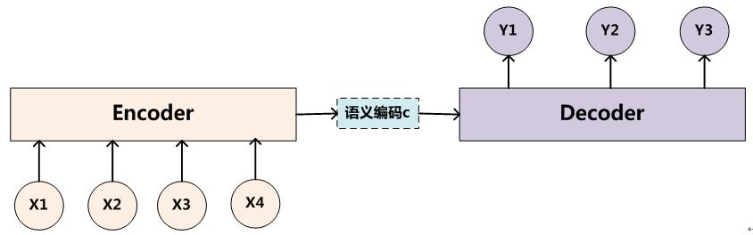

   经过attention对上下文c进行加权，decoder每步输入的c都不一样，更加关注翻译当前单词所需的上下文：

   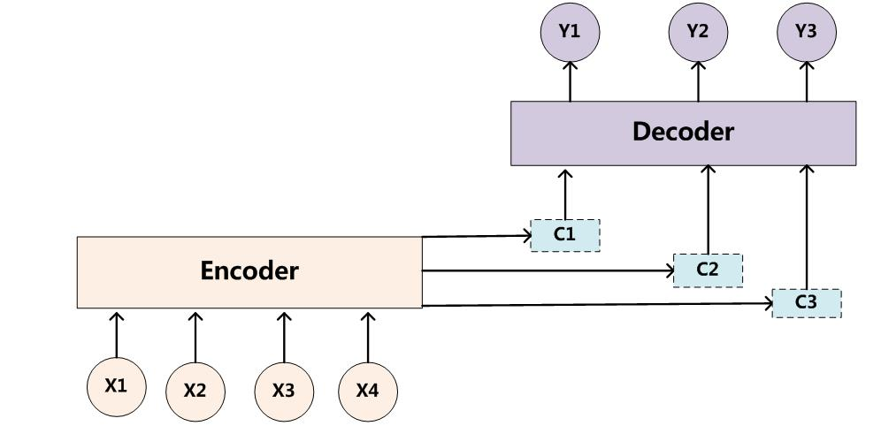

   效果展示：

   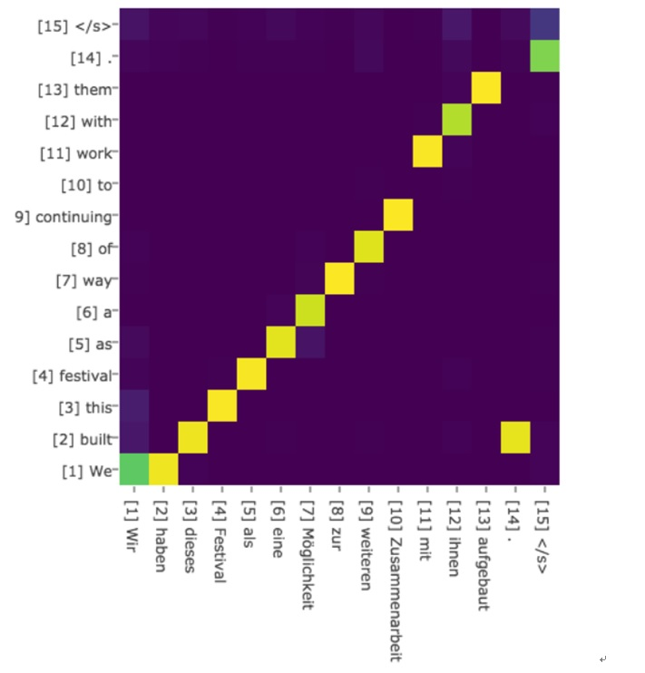

   

   

2. 任务聚焦、解耦（通过attention mask）

   多任务模型，可以通过Attention对feature进行权重再分配，聚焦各自关键特征。在图像分割论文***Fully Convolutional Network with Task Partitioning for Inshore Ship Detection in Optical Remote Sensing Images***中:

   针对靠岸舰船，本文通过任务解耦的方法来处理。因为高层特征表达能力强，分类更准，但定位不准；底层低位准，但分类不准。为了应对这一问题，本文利用一个深层网络得到一个粗糙的分割结果图（船头/船尾、船身、海洋和陆地分别是一类）即Attention Map；利用一个浅层网络得到船头/船尾预测图，位置比较准，但是有很多虚景。**训练中，使用Attention Map对浅层网络的loss进行引导，只反传在粗的船头/船尾位置上的loss，其他地方的loss不反传。**相当于，**深层的网络能得到一个船头/船尾的大概位置，然后浅层网络只需要关注这些大概位置，然后预测出精细的位置，图像中的其他部分（如船身、海洋和陆地）都不关注，从而降低了学习的难度。** 

   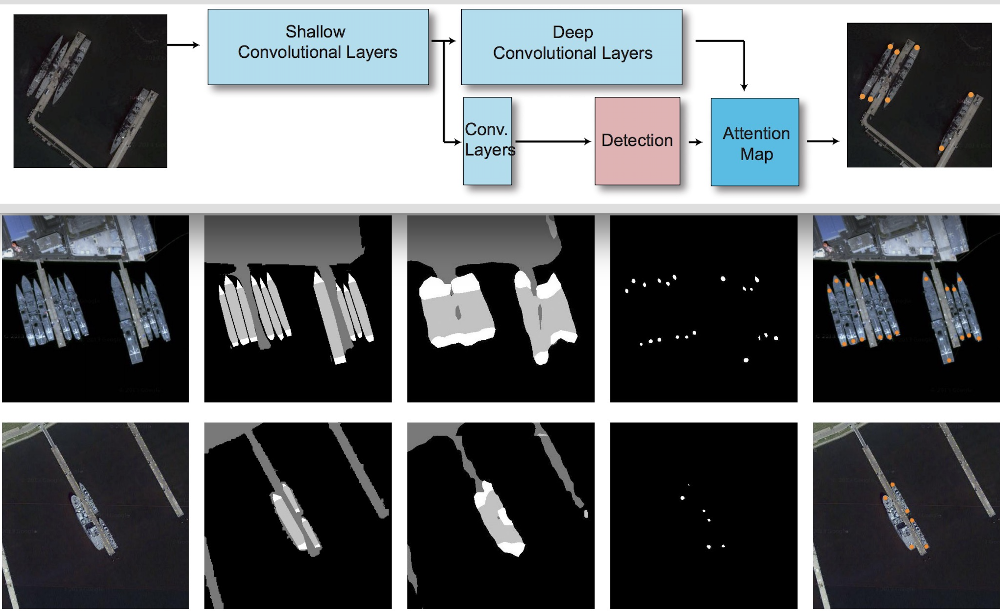

## （二）发展历程

​      Attention机制最早是在视觉图像领域提出来的，应该是在九几年思想就提出来了，但是真正火起来应该算是2014年google mind团队的这篇论文《Recurrent Models of Visual Attention》，他们在RNN模型上使用了attention机制来进行图像分类。随后，Bahdanau等人在论文《Neural Machine Translation by Jointly Learning to Align and Translate》中，使用类似attention的机制在机器翻译任务上将翻译和对齐同时进行，他们的工作算是第一个将attention机制应用到NLP领域中。接着attention机制被广泛应用在基于RNN/CNN等神经网络模型的各种NLP任务中。2017年，google机器翻译团队发表的《Attention is all you need》中大量使用了自注意力（self-attention）机制来学习文本表示。自注意力机制也成为了大家近期的研究热点，并在各种NLP任务上进行探索。下图展示了attention研究进展的大概趋势：

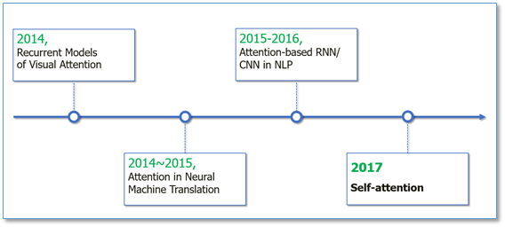

##（三）Attention设计

#### 3.1 定义

**$Attention(Q,K,V)=softmax(\frac{QK^T}{\sqrt{d_k}})V$**

Google 2017年论文[Attention is All you need](w)中，为Attention做了一个抽象定义：

> An attention function can be described as mapping a query and a set of key-value pairs to an output, where the query, keys, values, and output are all vectors. The output is computed as a weighted sum of the values, where the weight assigned to each value is computed by a compatibility function of the query with the corresponding key.
>
> 注意力是将一个查询和键值对映射到输出的方法，Q、K、V均为向量，输出通过对V进行加权求和得到，权重就是Q、K相似度。

计算Attention Weighted Value有三个步骤：

1. 计算Q、K相似度得分
2. 得分归一化(Attention Weight)
3. 根据得分对V进行加权

#### 3.2 分类

##### 3.2.1 按输出分类

+ Soft attention
+ Hard attention

soft attention输出注意力分布的概率值，hard attention 输出onehot向量。

##### 3.2.2 按关注的范围分类 

> [Effective Approaches to Attention-based Neural Machine Translation](2)

+ Globle attention

全局注意力顾名思义对整个feature mapping进行注意力加权。

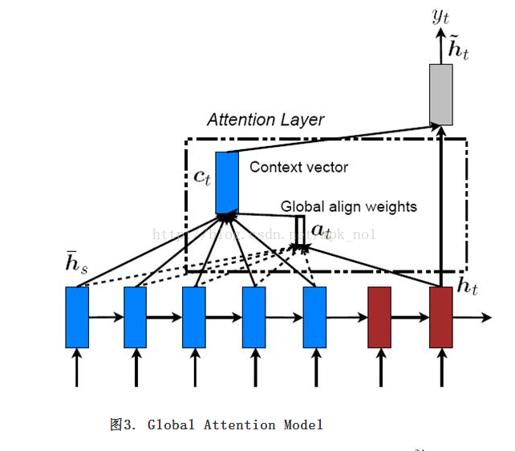

+ Local attention

局部注意力有两种，第一种首先通过一个hard-globle-attention锁定位置，在位置上下某个local窗口进行注意力加权。

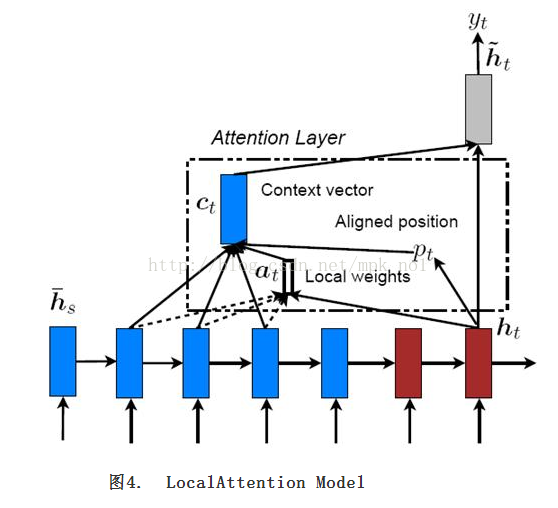

第二种是在某中业务场景下， 比如 对于一个问题"Where is the football?", "where"和"football’"在句子中起着总结性的作用。而这种attention只和句子中每个词自身相关。Location-based的意思就是，这里的attention没有其他额外所关注的对象，即attention的向量就是q本身，即Q=K，其attention score为：

$score(Q,K)=activation(W^TQ+b)$

##### 3.2.3 按计算score的函数不同

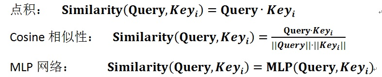

## （四）业务应用

+ chatbot意图分类

采用：Self-attention + Dot-product-score

$ Q =V = X_{embed}$

$K=activation(WX_{embed}+b)$

$ V_{attention} = MatMul(softmax(K \cdot Q), V) $

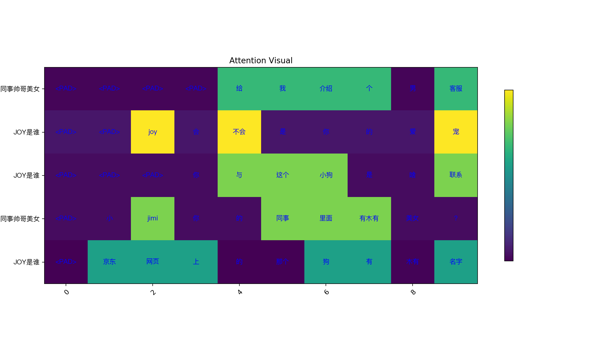

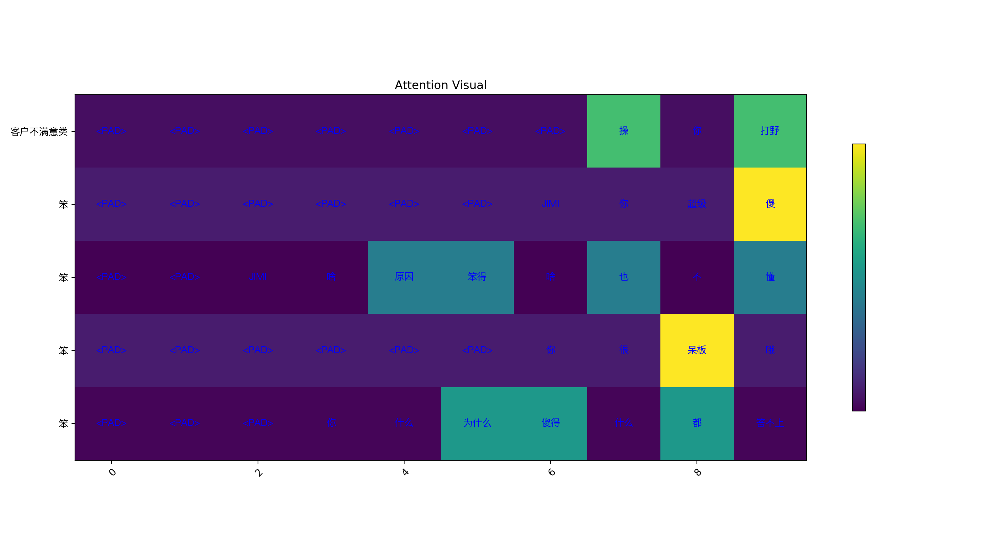

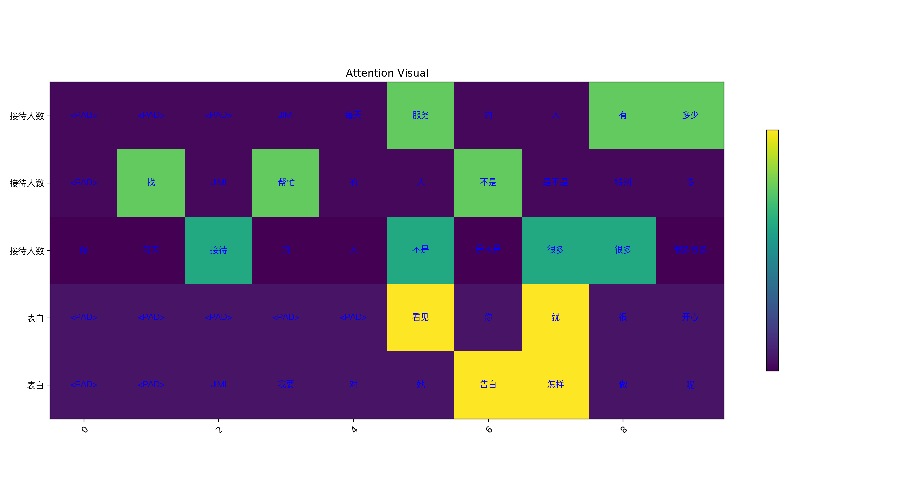

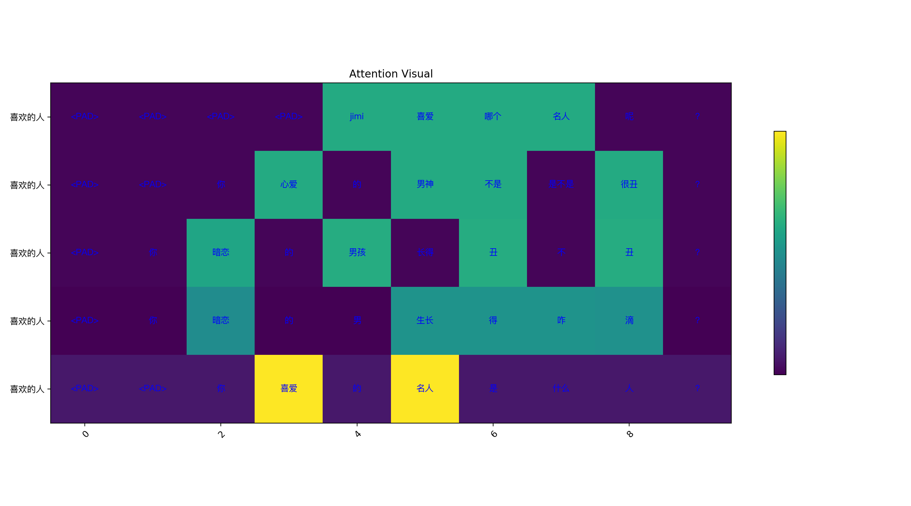

观察到：

1. attention自动mask了<PAD>字符；
2. 对于分类作用更大的关键词，给予了更高的attention weight；

+ 多步负荷预测

多任务多输出模型，每步预测对于特征的关注点应该不一样，学习一个feature mapping 的mask attention。

+ 异常数据mask负荷预测

在原始feature mapping 后接一个attention，自动mask 异常输入，提升模型的鲁棒性。

## （五）Reference

### Paper

1. [Hierarchical Attention Networks for Document Classification](https://www.cs.cmu.edu/~diyiy/docs/naacl16.pdf)
2. [Attention Is All You Need](https://arxiv.org/abs/1706.03762)
3. [Neural Machine Translation by Jointly Learning to Align and Translate]()
4. [Show, Attend and Tell: Neural Image Caption Generation with Visual Attention]()
5. [Fully Convolutional Network with Task Partitioning for Inshore Ship Detection in Optical Remote Sensing Images](ww)
6. [Effective Approaches to Attention-based Neural Machine Translation]()

### github
1. [pytorch-attention](https://github.com/thomlake/pytorch-attention)
2. [seq2seq](https://github.com/keon/seq2seq)
3. [PyTorch-Batch-Attention-Seq2seq](https://github.com/AuCson/PyTorch-Batch-Attention-Seq2seq)

### Blog
1. [一文读懂「Attention is All You Need」| 附代码实现 ](https://mp.weixin.qq.com/s?__biz=MzIwMTc4ODE0Mw==&mid=2247486960&idx=1&sn=1b4b9d7ec7a9f40fa8a9df6b6f53bbfb&chksm=96e9d270a19e5b668875392da1d1aaa28ffd0af17d44f7ee81c2754c78cc35edf2e35be2c6a1&scene=21#wechat_redirect)
2. [Attention Model（mechanism） 的 套路](https://blog.csdn.net/bvl10101111/article/details/78470716)
3. [【计算机视觉】深入理解Attention机制](https://blog.csdn.net/yideqianfenzhiyi/article/details/79422857)
4. [自然语言处理中的自注意力机制](https://www.cnblogs.com/robert-dlut/p/8638283.html])
5. [Encoder-Decoder模型和Attention模型](https://blog.csdn.net/u014595019/article/details/52826423)

